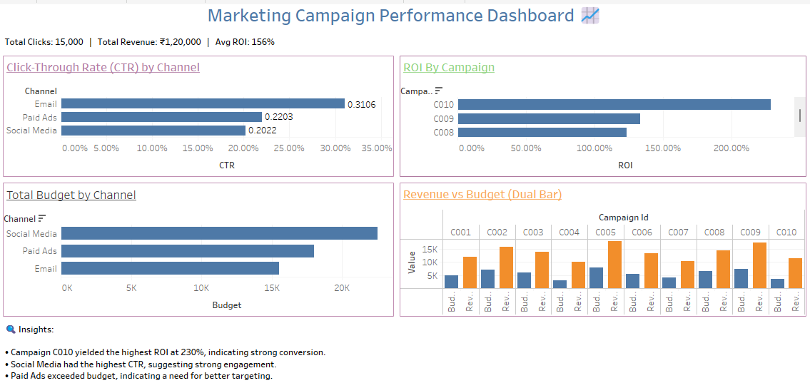

# 📊 Marketing Campaign Performance Analysis

A complete data analytics project analyzing digital marketing campaign performance using MySQL, Excel, and Tableau.

## 🔧 Tools Used
- **MySQL** – For data cleaning & analysis
- **Excel** – For basic cleaning & preparation
- **Tableau** – For dashboard visualization

## 📁 Files Included
- `marketing_campaign.sql` – SQL schema & queries
- `marketing_data.xlsx` – Raw and cleaned data
- `dashboard.twbx` – Tableau packaged workbook
- `screenshots/` – Visual of dashboard

## 📌 Key Insights
- Campaign C010 yielded the highest ROI (220%+)
- Social Media generated the most impressions
- Paid Ads had the highest revenue conversion rate

## 📉 Dashboard Preview

## 📬 Contact
Sushant Bhat | sushantbhat001@gmail.com
